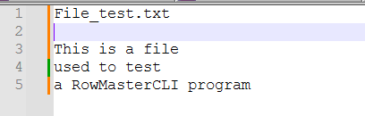
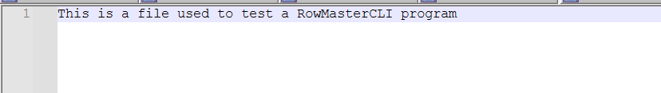

# RowMaster
A very simple CLI Java Program to convert columns in rows.
This program reads a file with columns and converts them into a single row file.

Example:
File with columns...



...will be converted to a file with rows.



## How to use
1. Download the jar file from the releases page
2. Open a terminal and navigate to the directory where the jar file is located
3. Run the following command:
```java -jar RowMaster.jar <input file> <output folder>```. Example: ```java -jar RowMaster.jar C:\foo\bar\input.txt C:\foo\bar```